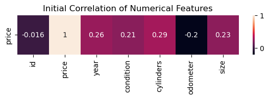
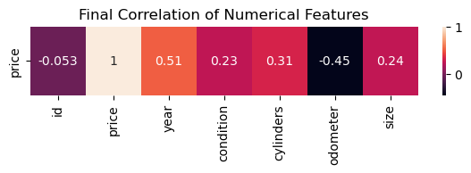
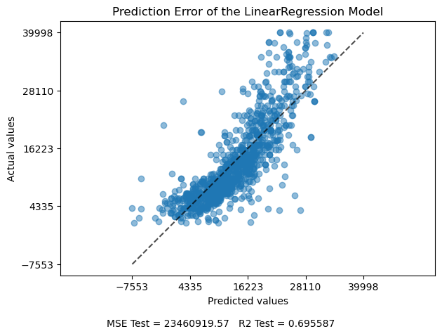
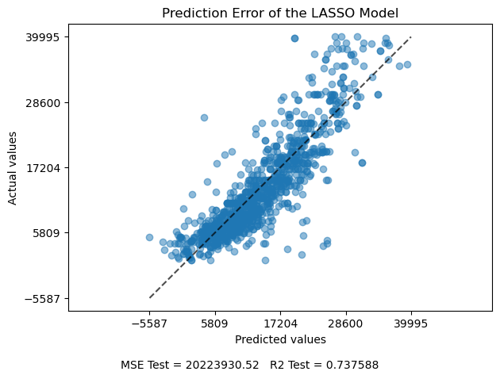
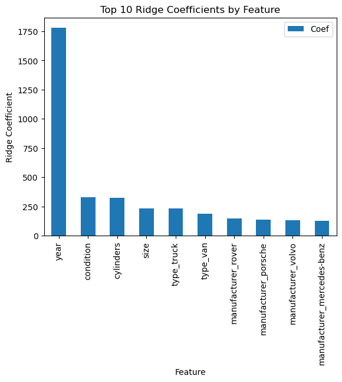

# UCB-MLAI-Practical-Application-2

# What Drives the Price of a Car?

## Business Understanding:

The objective of this task is to determine which features contribute most to determining the cost of a used vehicle. A data set has been provided containing 426880 rows and 18 features. To accomplish this task, the data set will be ananized to determine feature importance and models will be developed to predict the value of used vehicle based on the data set.

## Data:

The provided dataset contains 426,880 records with 18 features:
- id
- region
- price
- year
- manufacturer
- model
- condition
- cylinders
- fuel
- odometer
- title_status
- transmission
- VIN
- drive
- size
- type             
- paint_color
- state    

## Deliverables:
Detailed finding can be found in this Jupyter Notebook: [prompt.ipynb](https://github.com/jeremystairs/UCB-MLAI-Practical-Application-1/blob/main/prompt.ipynb)

Initial data: [data](https://github.com/jeremystairs/UCB-MLAI-Practical-Application-1/blob/main/data)

Images generated during analysis: [images](https://github.com/jeremystairs/UCB-MLAI-Practical-Application-1/blob/main/images)

## Data Understanding

For data understaning, the dataset was cleaned by removing duplicate records and records missing data. Also, some catagorical features will be encoded as numberical features.

Initially, none of the features had a strong correlation with price.

The was likely due to outliers.  With the outliers removed, stronger correlations were observed.

Summary of data understanding:
- price has outliers under 100 and over 40,000
- year has outliers under 1980
- odometer has outliers under 100 and over 250,000
- region and model both have a high cardinality
- VIN is an identifier with little influence over price
- condition and size are ordinal catagories
- cylinders can be directly converted to a numerical feature
- The other fields are catagorical

## Data Preparation

There are many redundant records with all values indentical except for id, region, and state. These duplicate records would have caused bias in the models. Removing the dulicate records reduced the size of the data set to 248,742 records. Removing records with missing data reduced the data set to 22951 records.

The columns 'id' and 'VIN' have no value for predicting price. The columns 'region', 'model', and 'state' each have high cardinality. These columns were all dropped. After dropping outliers, the final data set size was 19,854.

## Modeling

The data was modeled in three ways:
- Linear Regression with Sequential Feature Selection
- LASSO Regression
- Ridge Regression with GridCV cross validation

Mean Squared Error (MSE) was used as the evaluation metric. The dataset was large and most outliers were removed. Considering this, MSE was an appropriate evaluation metric. R-squared was used to describe the proportion of the variance explained by the the model.

## Evaluation

Comparison of model performance:

Model | Training MSE | Training R^2 | Test MSE | Test R^2 | Contributing Features
---:|:---:|:---:|:---:|:---:|:---
**LinearRegression** | 22771903.56 | 0.709591 | 23460919.57 | 0.695587 | year, odometer, and cylinders
**LASSO** | 15653194.83 | 0.800375 | 20223930.52 | 0.737588 | year, cylinders, fuel_diesel and condition
**Ridge** | 14954320.18 | 0.809288 | 15486596.69 | 0.799057 | year, condition, cylinders, and size 

The Ridge model performed best. Based on this model, the features **year**, **condition**, **cylinders**, and **size** had the most influence over the price. Cumulitively, **type** and **manufacturer** also had a significant affect on the model.

## Recommendations

The features year, condition, cylinders, and size should most considered when evaluating a potential vehcile. If needed, a prediction model can be deployed to predict the sales price of unsold vehicles.

The model could be improved by providing a larger data set. Many of the recods in the provided data set were removed because of missing data or duplication. With more time, some of the missing data could be recovered. For example, VIN or model could be used to determine size, year, and number of cylinders.

The outlier thresholds listed in the 'Summary of data understanding' could be adjusted to match the typical values in the dealer's vehicle stock.